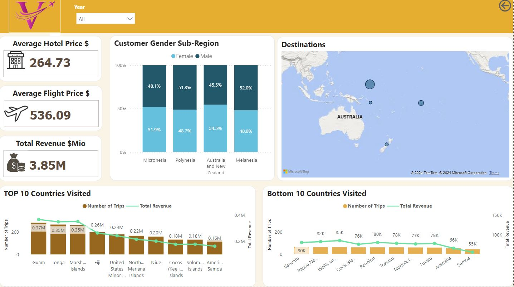

# Travel Booking Business Analysis

This project aims to analyze a travel booking company, focusing on profit analysis and the various factors that affect their attainment.Using Power BI to design graphical analysis that allows for useful insights for different areas.  

### raising_hand **Status**
2.1, Ironhack Data Analytic:second project

### **Data Model**

The dataset has been generated using the Python faker library, and the script can be found in this repository (travel_data_generator). With the generated CSVs, a DuckDB database has been created and the various dimension tables have been loaded into Power BI. A fact table has been created to design the visualizations.

An additional CSV has been added to the database to group countries by region and sub-region. Within Power BI, a fact table has been created to work with by combining multiple tables and transforming several columns.

### **Dashboards**

### Summary  Overview:

On this page, you can view a summary of the company's revenues, with the option to see the view with various filters.

### Destination Overview:

On this page, various destinations are analyzed, grouped by continents.

### Destination Area Overview:

On this page, accessed through a Drill Through from the previous page, we offer a slightly more detailed view of the sub-regions and countries within the different continents filtered on the previous page.

### Customers Overview:

On this page, we study the profile and origin of the customers.

### Type of Trip Overview:

On this page, we analyze the different types of trips.

